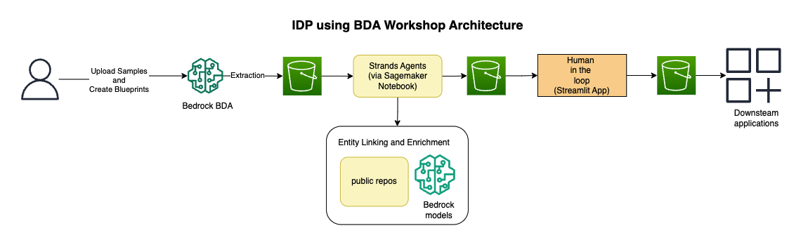
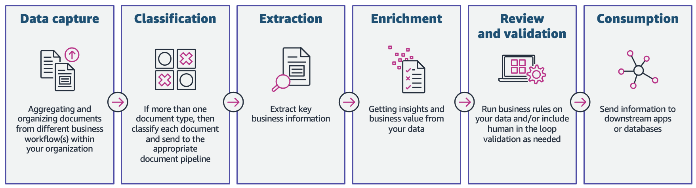

# genai_idp_healthcare

## Overview

This workshop is designed for you to understand the different phases of Intelligent Document Processing (IDP) using Bedrock Data Automation (BDA).
To learn more about IDP, please visit the playbook at [IDP Playbook](https://aws.highspot.com/items/6824b60a1eab30af887c1fdc?lfrm=shp.7#1)

Most customers manually process these documents to extract information and insights. This is time consuming, error prone, expensive, and difficult to scale. Not only do you want information extracted from your documents quickly, but you also want to automate business processes that presently rely on manual inputs and intervention across various file types and formats.

To help you overcome these challenges, this workshop shows you how to build an IDP pipeline using AWS services.

## Workshop Introduction  

## Phases of an Intelligent Document Processing (IDP) workflow

In this workshop, we will dive deep into each of the phases of an IDP workflow with solutions on how to implement each step using AWS AI services. With the hands-on labs, you will familiarize yourself with [Amazon Bedrock](https://aws.amazon.com/bedrock/), [AWS Strands](https://strandsagents.com) and [AWS Sagemaker](https://aws.amazon.com/sagemaker-ai/) notebooks. You will learn how these services and tools can work together to help you build an end-to-end IDP solution.

We will be using a Health Care use case to demonstrate the IDP pipelines. However, this can apply to any industry. 

**Use Case: Intelligent Document Processing for MediCare Plus**

MediCare Plus, a leading healthcare provider, is implementing an Intelligent Document Processing (IDP) pipeline to streamline the management of their medical records. The IDP pipeline processes various types of documents, such as patient histories, lab results, and prescriptions. It begins by classifying these records into specific categories, followed by normalizing and transforming the data into a standardized format. Key information is then extracted and enriched by linking it with internal systems. A human-in-the-loop step ensures that all data is reviewed and verified for accuracy before it is sent to downstream applications for final consumption.

## What's included in the workshop?

There are 6 main labs in this workshop

### Module 1 Introduction

This module will run through how to set up the prerequisite services and tools that we will be using for this workshop. 

### Module 2 - Classification, Normalization, Transformation

In this module we will cover three different phases of IDP pipeline. i.e., Classification, Normalization and Transformation. We will leverage the features of BDA to implement this. We will set up classification in this module

### Module 3 - Extraction

This module will cover the extraction of specific information from the document using BDA APIs. We will also see classification in action in this module. Furthermore, we can also cover validation step in this module

### Module 4 - Enrichment

In this module we will demonstrate how to enrich and link the extracted data using an agentic flow. We will show how AWS Strands SDK makes it easy to do this.

### Module 5 - Human-in-the-Loop